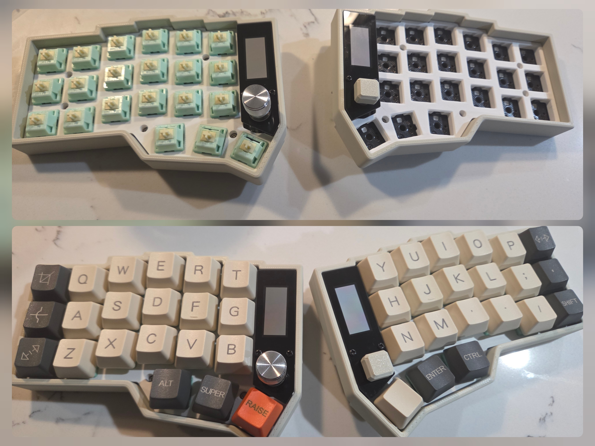

# (Eyelash Peripherals) Corne ZMK Repository



Bought from AliExpress [Highland 3C Store](https://www.aliexpress.us/item/3256807477869827.html)

**This keyboard is not the same as [foostan's Corne](https://github.com/foostan/crkbd). It will not work with standard `corne` firmware.**

If you need a 3D model of this keyboard, email `380465425@qq.com`.

### New changes
2025.8.22 update the soft off. 
When you press the keys Q, S and Z simultaneously and hold them for 2 seconds, the keyboard will enter a deep sleep state and cannot be awakened by pressing the keys. This function can be used when carrying it outside. 
The activation method is to press the reset switch once. 

## Keymap Diagram Generation (Local)

Generate keymap diagrams locally to validate syntax before pushing.

### One-time setup

```bash
python3 -m venv .venv
source .venv/bin/activate
pip install keymap-drawer
```

### Parse and draw

```bash
source .venv/bin/activate
keymap parse -z config/eyelash_corne.keymap > keymap-drawer/eyelash_corne.yaml
keymap -c keymap_drawer.config.yaml draw keymap-drawer/eyelash_corne.yaml > keymap-drawer/eyelash_corne.svg
```

Parsing catches syntax errors faster than a full firmware build.

### Quick remapping via ZMK Studio (no build needed)

For simple key binding changes, connect the left half via USB-C and open [ZMK Studio](https://zmk.studio/) in Chrome/Edge. Changes are applied live over USB — no tools or network access required.

## Firmware Build (GitHub Actions)

Firmware is compiled via GitHub Actions — local builds require a full [Zephyr SDK](https://docs.zephyrproject.org/latest/develop/getting_started/index.html) and ARM toolchain which are not included in this repo.

1. Push your changes to GitHub.
2. [Ensure the Actions workflow is enabled](https://docs.github.com/en/actions/managing-workflow-runs-and-deployments/managing-workflow-runs/disabling-and-enabling-a-workflow#enabling-a-workflow).
3. Download the `.uf2` firmware artifacts from the completed workflow run.
4. Flash — put each half into bootloader mode (double-tap reset), then drag the `.uf2` file onto the USB mass storage drive.

### Security Notes

This fork was audited for supply-chain and hardware security risks. Below is a summary of findings and actions taken.

### Resolved: Remote board module pinned to local only

The upstream `config/west.yml` pulls the board definition from `github.com/a741725193/zmk-new_corne` at `revision: main` (unpinned). Since this feeds directly into firmware compilation, an unreviewed upstream push could alter pin mappings, flash partitions, or BLE configuration.

**Action taken**: The remote module reference in `config/west.yml` has been commented out. The build now uses only the local `boards/arm/eyelash_corne/` directory. To re-enable the remote, pin it to a specific audited commit SHA.

### Accepted: Keymap Drawer workflow unpinned (`@main`)

The `.github/workflows/draw.yml` workflow references `caksoylar/keymap-drawer` at `@main` with `contents: write` permission. This is a diagram generation utility maintained by a well-known ZMK community contributor. It only produces SVG files in `keymap-drawer/` and cannot affect firmware builds. Commits it creates are clearly labeled `[Draw]`. The risk is negligible for this use case.

### Accepted: ZMK Studio locking disabled

The left half build includes `-DCONFIG_ZMK_STUDIO_LOCKING=n`, allowing keymap changes via USB without authentication. This requires physical access to the keyboard and is appropriate for personal use. Changes made via Studio can be reset. Re-enable locking (`-DCONFIG_ZMK_STUDIO_LOCKING=y`) if the keyboard will be used in a shared or untrusted environment.

## Keymap Diagram

 

_generated by @caksoylar's Keymap Drawer_

